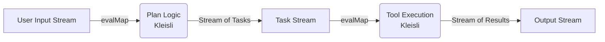

# Chapter 10 — 与 FRP 的关系：当 Agent 变成“事件流处理器” (chapter10.md)

## 1. 开篇段落：打破“请求-响应”的幻觉

在前九章中，我们构建的 Agent 主要是基于 **IO Monad** 和 **Kleisli Arrow** 的。这种视角的隐含假设是：世界是**离散**且**串行**的——用户发一个请求，Agent 思考、行动、最后给出一个完整的答复。

然而，在真实的生产级应用（如 Cursor, ChatGPT, Claude）中，用户体验（UX）的需求远比这复杂：

* **Token Streaming**：用户不能等 10 秒才看到第一个字，他们需要看到“打字机”效果。
* **Cancellation (打断)**：当 Agent 正在写一段冗长的代码时，用户发现需求描述错了，点击“停止生成”或直接输入新指令。Agent 必须立即停止当前的思维链。
* **Push Events (服务端推送)**：系统可能需要主动告诉 Agent “你的额度用完了”或“底层知识库正在更新，暂停检索”。
* **Multimodal Sync (多模态同步)**：当 Agent 同时处理语音流和文本流时，如何对齐时间轴？

这时，单纯的 `IO a`（描述一个动作）已经不够用了。我们需要 **FRP (Functional Reactive Programming)**。FRP 让我们将 Agent 视为一个**随时间变换的信号处理器**，而不仅仅是一个函数。

**本章学习目标**：

1. **思维转换**：从“执行步骤”转向“处理流”。
2. **架构融合**：理解如何将 Kleisli Arrow (`a -> IO b`) 嵌入到 Stream (`Stream IO a`) 中。
3. **核心模式**：掌握 `switchMap`（处理打断）、`merge`（处理并发）、`scan`（处理状态累积）在 Agent 中的应。
4. **背压 (Backpressure)**：如何优雅地处理 LLM 生成速度与网络传输速度不匹配的问题。

---

## 2. 核心概念：时间轴上的值

FRP 的核心在于引入了**时间**作为一等公民。在 Haskell/Scala 的函数式生态（如 fs2, ZIO-Stream, RxJS）中，我们主要关注两个抽象：

### 2.1 Event / Stream (离散事件流)

描述在时间轴上零星发生的一系列事件。

* **类型隐喻**：`Stream[IO, A]` ≈ `List[A]` 但分布在时间轴上，且获取下一个元素可能包含副作用（IO）。
* **Agent 场景**：
* LLM 生成的每一个 Token (`Token "H"`, `Token "e"`, `Token "llo"`...)。
* Tool 调用的中间状态 (`Log "Searching Google..."`, `Log "Found 3 results"`...)。
* 用户的输入消息流。


```text
[ASCII Diagram: The Event Stream]
Time:   0s------1s------2s------3s------4s------>
Stream: O-------O-------O-------X-------|
Values: "User"  "Start" "Think" Error   End

```

### 2.2 Behavior / Signal (连续行为)

描述任意时间点都有定义的值。通常由 Stream 通过 `scan` (累积) 或 `hold` (保持) 得到。

* **类型隐喻**：`Signal[IO, A]` ≈ `Time -> A`。
* **Agent 场景**：
* 当前已经累积生成的完整回复文本（String）。
* Agent 的当前情绪状态或上下文窗口的占用率。
* 当前的 UI 状态（"Idle", "Generating", "Error"）。


```text
[ASCII Diagram: Behavior from Events]
Events:   ---"H"---"e"---"l"---"l"---"o"--->
Behavior: "H"    "He"  "Hel" "Hell" "Hello"  (总是持有当前完整值)

```

---

## 3. 架构融合：Kleisli 在 Stream 内部

很多开发者困惑：“如果我用了 Stream，还要 Kleisli 吗？”
答案是：**必须还要。**

* **Kleisli (`Input -> IO Output`)** 定义了**原子逻辑**（例如：如何调用一次 LLM，如何执行一次 SQL）。
* **Stream** 定义了**逻辑的调度与组合**（例如：对每个用户输入，执行一次 Kleisli 逻辑，并把结果扁平化输出）。

### 3.1 核心算子：`evalMap` (或 `mapAsync`)

这是连接两个世界的桥梁。它允许我们在流的每一个元素上运行一个 IO Effect（即 Kleisli Arrow）。

```haskell
-- 伪代码类型签名
evalMap : (a -> IO b) -> Stream IO a -> Stream IO b

```

**Agent 管道示例**：



这不仅让代码保持了 Kleisli 的可组合性，还赋予了它流式的特性。

---

## 4. 关键交互模式解析

本节介绍 FRP 如何优雅解决传统 Promise/Future 模式下极难处理的 Agent 交互问题。

### 4.1 模式一：SwitchMap 实现“喜新厌旧” (Cancellation)

**场景**：用户问“如何做番茄炒蛋？”，Agent 开始联网搜索、写步骤（预计耗时 10s）。2s 后，用户改主意了，输入“算了，做红烧肉吧”。

**传统做法**：你需要手动护一个 `currentTaskReference`，每次新请求进来先 `cancel()` 旧任务。代码非常命令式且易碎。

**FRP 做法 (`switchMap`)**：
`switchMap` 的语义是：当上游产生新值（新用户消息）时，**立即取消**下游正在进行的流（旧的消息处理逻辑），并订阅新流。

```typescript
// FRP 风格伪代码
const outputStream = userInputStream.pipe(
  // 当新消息到来，自动取消上一条消息产生的处理流
  switchMap(userMsg => 
    runAgentPipeline(userMsg) // 返回 Stream<Token>
  )
);

```

**结果**：Agent 永远只处理“最新”的指令，旧的计算资源被自动释放（包括关闭 HTTP 连接、停止 LLM 推理），无需一行手动的 `cancel` 代码。

### 4.2 模式二：Merge 实现“多路输出” (Interleaved Output)

**场景**：Agent 在思考（Thinking Process）的同时，可能在并行调用工具。我们需要在 UI 上同时展示“思考链日志”和“最终回复 Token”。

**FRP 做法 (`merge`)**：
Agent 的执行函数可以返回一个混合类型的流：`Stream[IO, Either[Log, Token]]`。

```haskell
type AgentEvent = Log String | Token String | ToolResult Json

-- 内部逻辑：同时跑两个流
runAgent :: Query -> Stream IO AgentEvent
runAgent q = 
  let thoughtStream = streamThoughts q   -- 产生日志
  let answerStream  = streamAnswer q     -- 产生 Token
  in merge(thoughtStream, answerStream)  -- 合并输出

```

### 4.3 模式三：Debounce 解决“羊群效应”

**场景**：Agent 接入了一个实时的文档编辑器。每当用户打字，Agent 都要检查是否需要提供补全。如果用户打字很快（5次/秒），直接触发 Agent 会导致昂贵的 API 调用和速率限制（Rate Limit）。

**FRP 做法 (`debounce`)**：
`debounce(500ms)`：只有当输入流静止 500ms 后，才把最新的值发射出去。

```text
Input:  H-e-l-l-o-(pause)------W-o-r-l-d-(pause)-->
Debounce: ------------------"Hello"---------------"World"-->
Output:   ------------------Trigger Agent----------Trigger Agent-->

```

---

## 5. 背压 (Backpressure)：流控的艺术

在 IO Monad 中，我们很少谈论背压，因为它是同步阻塞的。但在流式系统中，如果 **生产者（LLM）** 比如每秒生成 100 个 Token，而 **消费者（前端/网络）** 每秒只能处理 10 个，会发生什么？

1. **无背压 (Push-based, e.g., standard Callbacks)**：内存中堆积大量未发送的 Token，最终导致 OOM (Out of Memory)。
2. **有背压 (Pull-based, e.g., fs2, Rust AsyncStream)**：
* 下游处理完一个，才向上游请求下一个。
* 这种“拉取”信号会一直传播到源头。
* 如果网络慢，Agent 内部的迭代器就会暂停执行（Suspend）。
* **结果**：系统内存占用恒定，不会因为网络抖动而崩溃。


> **Rule of Thumb**: 在构建高并发 Agent 服务网关时，务必选用支持背压的 Stream 库（如 Scala fs2, Java Reactor, Rust Tokio-Stream）。

---

## 6. 本章小结

1. **IO 是骨，FRP 是神经**：IO Monad 定义了静态的依赖关系，FRP 定义了动态的数据流动。
2. **Agent 是流转换器**：最通用的 Agent 签名不是 `Input -> Output`，而是 `Stream Input -> Stream Output`。
3. **时间是逻辑的一部分**：超时、重试、打断、去抖动，这些不是“基础设施代码”，而是应该用 FRP 算子表达的“业务逻辑”。
4. **取消是自动的**：通过 `switchMap` 和 `takeUntil`，我们获得了免费的并发安全性和资源清理能力。

---

## 7. 练习题

### 基础题

**Q1. 状态映射**
假设你的 Agent 输出流包含三种事件：
`data Event = Start | Token(String) | End`
请写出（伪代码）如何利用 `scan` (fold) 算子，将这个事件流转换为一个包含“当前完整文本”的 **Behavior**。

<details>
<summary>参考答案</summary>

```haskell
-- 状态类型
data State = State { text: String, isFinished: Boolean }
initialState = State("", false)

-- 转移函数
update :: State -> Event -> State
update s Start    = s
update s (Token t)= s { text = s.text + t }
update s End      = s { isFinished = true }

-- FRP 转换
textBehavior :: Stream IO Event -> Stream IO State
textBehavior events = events.scan(initialState)(update)

```

*解释：`scan` 从初始状态开始，对每一个新事件应用更新函数，并输出新的状态流。这让我们能随时获得当前的完整文本。*

</details>

**Q2. 简单的超时**
使用流式算子，描述这样一个逻辑：
“启动 Agent 思考，如果 5 秒内没有产生任何 Token（注意：不是完成，是没有任何输出），则切换到备用的规则引擎 Agent。”

<details>
<summary>参考答案</summary>

```typescript
// 伪代码
llmStream
  .timeout(5.seconds) // 如果 5s 内无元素，抛出 TimeoutError
  .handleErrorWith(error => {
     if (error instanceof TimeoutError) {
       return ruleEngineStream // 切换到备用流
     } else {
       throw error
     }
  })

```

*关键点：`timeout` 算子用于元素到达的时间间隔。*

</details>

**Q3. 去重过滤**
有些劣质模型会陷入重复循环，疯狂输出 "User: User: User: ..."。
请设计一个流处理器，检测连续重复的 Token 块，如果发现重复，则终止流。

<details>
<summary>参考答案</summary>

```haskell
distinctUntilChanged :: Stream IO Token -> Stream IO Token
distinctUntilChanged s = s.zipWithPrevious.flatMap { (prev, current) ->
  if prev == current then Stream.empty (or raise Error)
  else Stream.emit(current)
}

```

*进阶提示：简单的 `prev == current` 只能检测单词级重复。真正的 loop detection 需要维护一个较大的滑动窗口 (Sliding Window)。*

</details>

### 挑战题

**Q4. "Human-in-the-loop" 的流式建模**
设计一个 Agent 工作流：

1. Agent 分析问题，提出 Plan（Stream 输出）。
2. **暂停**，等待用户在 UI 上点击“批准”或“修改”。
3. 收到批准后，继续执行工具调用（Stream 输出）。
这在 FRP 中如何达？特别是“等待用户”这一步，流并没有结束，只是挂起了。

*Hint: 使用 `Queue` 或 `Deferred` 来桥接用户输入与流。*

<details>
<summary>参考答案</summary>

这是一个典型的 **Async Coordination** 问题。

1. Agent 流执行到 Plan 阶段，将 Plan 推送到 UI。
2. 然后，Agent 流进入 `flatMap`，挂起在一个 `Promise` (或 `Deferred`) 上。
3. `agentFlow = planStream.flatMap(plan -> waitForUserApproval(plan).flatMap(approval -> execute(plan)))`
4. UI 上的点击事件触发 `promise.complete(approvalData)`。
5. 流解除阻塞，继续运行。

在 FRP 中，这也可以通过将“用户点击流”与“Agent 状态流”进行 `zip` 或 `withLatestFrom` 来实现，但利用 `Deferred` 在 IO 层控制通常更直观。

</details>

**Q5. 复杂的重试策略 (Retry with Backoff)**
实现一个算子 `retryWithBackoff`，它接受一个可能失败的流。如果流报错，它会重新订阅该流，但在重试前会等待  秒。如超过 3 次失败，则彻底抛出异常。
要求：不仅仅是重试 HTTP 请求，而是重试整个流的生成过程。

<details>
<summary>参考答案</summary>

```scala
def retryWithBackoff[A](source: Stream[IO, A], retries: Int, delay: FiniteDuration): Stream[IO, A] = {
  source.handleErrorWith { err =>
    if (retries > 0) {
      // 产生一个纯等待的流，然后拼接上递归调用的流
      Stream.sleep[IO](delay) ++ 
      retryWithBackoff(source, retries - 1, delay * 2)
    } else {
      Stream.raiseError(err)
    }
  }
}

```

*这个模式体现了流的**组合性**：重试逻辑只是包裹在原始流外面的另一层流。*

</details>

---

## 8. 常见陷阱与错误 (Gotchas)

### 8.1 陷阱：IO 不纯导致流不可复用

**场景**：

```scala
val request = http.post("...") // 这是一个已经执行的 Future/Promise，不是 IO 描述！
val stream = Stream.eval(request).repeat

```

**错误**：如果在构建 Stream 之前就把 IO 执行了（即变成了 eagerly evaluated 的值），那么 `repeat` 只会重复发射同一个结果，而不会重新发起 HTTP 请求。
**修正**：确保传给 Stream 的是 `IO` (描述)，而不是 `Future` (运行中的任务)。必须用 `Stream.eval(IO.delay(...))`。

### 8.2 陷阱：在 flatMap 中忘记处理下游关闭

**场景**：你写了一个自定义的 `Piping` 逻辑，从 socket 读取数据。
**现象**：用户关闭了连接，但你的 Agent 还在后台疯狂跑，因为你没有检查 `downstream.isCancelled`。
**修正**：使用高阶 FRP 库（如 fs2/ZIO）通常会自动处理上游取消传播。但如果你手写 `while` 循环在 IO 中推数据，必须周期性检查 `context.isCancelled`。

### 8.3 陷阱：混淆 Log 流与 Result 流

**现象**：下游消费者期望收到 JSON 格式的最终答案，但你在同一个流里混入了 `String` 类型的 "Thinking..." 日志，导致 JSON 解析器崩溃。
**修正**：

1. 使用 **Sum Type** (Union Type) 包装所有输出`Event = Log String | Result Json`。
2. 或者使用 **Side Channel**：日志走 `Writer` Monad 或独立的 Logger 收集器，只有纯净的结果进入主数据流（视需求而定，交互式 Agent 通常推荐方案 1）。

### 8.4 陷阱：不小心把 Cold Stream 变成了 Hot Stream

**场景**：`val s = Stream.eval(expensiveAIQuery)`。
如果有两个 UI 组件订阅了 `s`（一个显示弹窗，一个显示历史记录），`expensiveAIQuery` 会被执行两次，扣两份钱。
**修正**：使用 `broadcast` 或 `share` 算子，让多个订阅者共享同一个底层的执行源。
